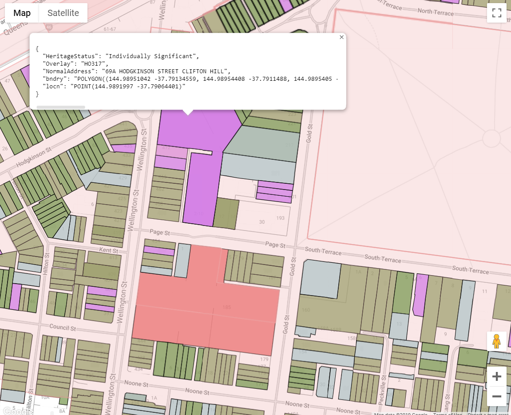

# Yarra Heritage Maps  

Web App to display a map of Heritage Overlays, Heritage Gradings and Heritage Data for properties in the City of Yarra
A heritage overlay can be selected with double-click to see properties and applications inside the overlay.

Relies on Tables in BigQuery




## Terms

This tool is provided as is for educational purposes.

It is not a substitute for the reference planning documentation.

**Data may be incorrect, incomplete or out of date!**

For planning matters, always refer to the reference documents for reliable information:

### Yarra Planning Scheme
- [Yarra Planning Scheme](http://planningschemes.dpcd.vic.gov.au/schemes/yarra)
- [Yarra Planning Scheme Heritage Overlay Maps](http://planningschemes.dpcd.vic.gov.au/schemes/yarra/maps)
- [City of Yarra Heritage review Appendix 8](https://www.yarracity.vic.gov.au/the-area/planning-for-yarras-future/yarra-planning-scheme-and-amendments/incorporated-documents)
- [Victorian Heritage Database](https://vhd.heritagecouncil.vic.gov.au)
- [Clause 43.01 HERITAGE OVERLAY](http://planningschemes.dpcd.vic.gov.au/schemes/vpps/43_01.pdf)
- [Clause 43.01 SCHEDULE TO THE HERITAGE OVERLAY](http://planningschemes.dpcd.vic.gov.au/schemes/yarra/ordinance/43_01s_yara.pdf)
- [Clause 22.02 DEVELOPMENT GUIDELINES FOR SITES SUBJECT TO THE HERITAGE OVERLAY](http://planningschemes.dpcd.vic.gov.au/schemes/yarra/ordinance/22_lpp02_yara.pdf)

## Development and Run

To run the app locally you must first run a REST server to handle the back end calls.

The server must be able to access the required BigQuery tables and views. 

First run the api server in a bash shell. This requires a python environment. See server/README.md for more details.

### Preconditions

- Choose an linux environment (WSL or git bash)
- Create and Activate a python virtual environment with python > 3.7
- Install required python libraries reqirements.txt
- Start the server.

For more info see [server/README.md](server/README.md)

```bash
# Start an API server at http://localhost:8080/.
npm run server
```

In a separate shell, run the app locally # Start a dev server at http://localhost:4200/.

```shell
npm run dev

```
### Resources

- [Google Maps JavaScript API documentation](https://developers.google.com/maps/documentation/javascript/)
- [Google BigQuery REST API documentation](https://cloud.google.com/bigquery/docs/reference/rest/v2/)
- [Angular](https://angular.io/)
- [D3.js](https://d3js.org/)
- [TypeScript](https://www.typescriptlang.org/)
- [Documentation] (https://cloud.google.com/bigquery/docs/gis-analyst-start)

## Production Build

First a production build of the angular app sets the target to server/app.
Now the angular app is an asset of the server that can be served by the / url
Test it by going to localhost:8080/

```shell
npm run build
```

This is short hand for:

```shell
ng build --prod --configuration=production
cp -r src/assets/* server/app/assets/
```

npm run build will build the app to output path defined in angular.json  "outputPath": "server/app/",
Check that there is a copy of src/assets in server/app/assets.

## Deployment

To deploy to Yarra Heritage Maps app engine
Note that it is the server that gets deployed to app engine. It serves the angular assets as content.
(A CDN would be quicker!)

First complete a product build that targets the binaries to server/app as described above.

Next activate gcloud, authenticate and configure the default project to yarrascrape

```shell
npm run deploy
```

If this doesn't work (it probably won't):

- Install gcloud, the google cloud SDK. https://cloud.google.com/sdk/docs/install
- Set up a conda env called heritagemaps
- Activate the env
- Set any environment variables (TBD)
- Authenticate gcloud and set the project.
- deploy the app with gcloud SDK.

```shell
cd server 
conda activate heritagemaps
gcloud init
gcloud app deploy --quiet app.yaml --project yarrascrape
```
